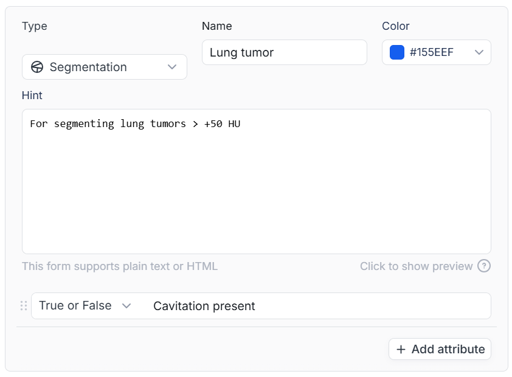
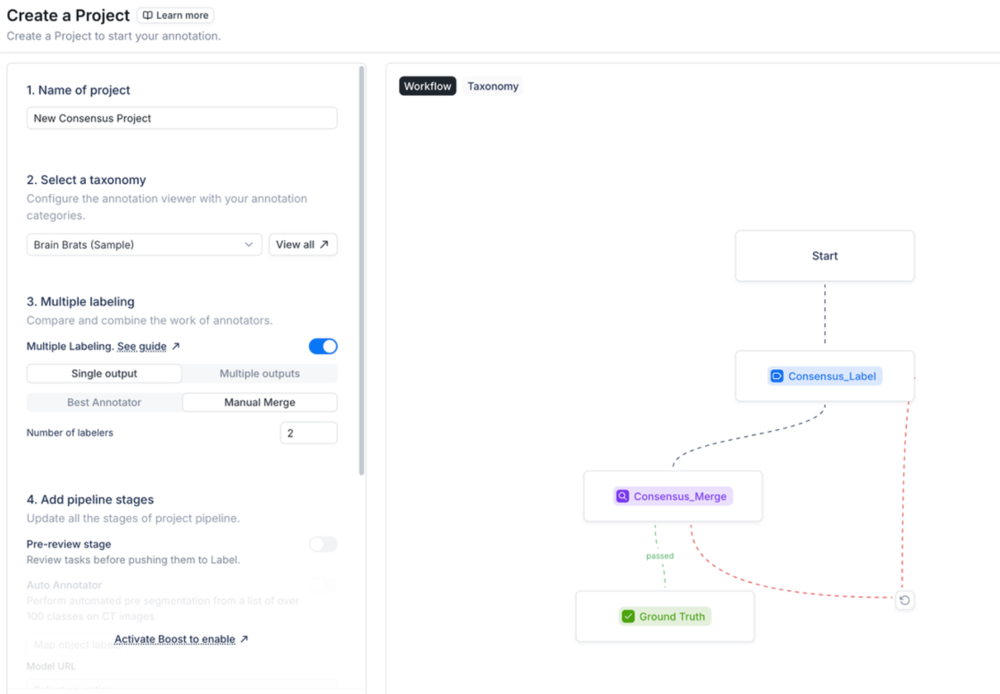

# Introduction
This guide outlines the key steps for setting up a new project on the RedBrick platform and includes a quick walkthrough to help teams get started.

---

## Overview
When creating a new project on RedBrick, a team must designate a lead who will be given admin access to create and set up a project. The following should be defined when starting a project:
1. **Data Import**: Prepare data for labeling.
2. **Labeling Taxonomy**: Create a clear schema of labels and attributes to help improve the quality of labeled data.
3. **Team Roles and Responsibilities**: Define roles and permissions of the labeling team.
4. **Project Workflow**: Define process for labeling and quality assurance.
5. **Labeling Quickstart**: Describes the project workflow for common use cases.

Watch [**Overview of Project Admin Video**](https://www.youtube.com/watch?v=J0Wf1Kvhfv0&list=PLjI4V6WYNAySdSCPx0oI1pMo9hhrr7OA5)

Finally, the following sections are recommended after setting up a project.
1. **Segmentation Guide**: Overview of labeling tools.
2. **Data Export**: How to access data.

---

## Data Import

### Data Upload

### Cloud Storage

### Uploading Labels
There are cases where you may want to load a set of labels into RedBrick. 
- Adding model generated pre-labels to decrease labeler workload.
- Adding model pre-labels to serve as benchmark for a clinical validation study.
- Adding ground truth labels for part of the dataset to assist with labeler training and assessment.

## Labeling Taxonomy
Taxonomies help organize how you label data in RedBrick AI, ensuring consistency across projects. When setting up a taxonomy, you'll define:
- **Types of Labels**: Examples include Segmentation or Bounding Boxes.
- **Label Names**: Such as "Edema."
- **Attributes**: Add extra details using checkboxes (True/False), dropdown options, multiple choices, or text fields.
- **Classifications**: Attributes added to studies, series, or video frames to provide more information.
- **Hints**: Instructions visible when hovering over labels.

To create a taxonomy:
1. Navigate to the **Taxonomies** tab.
2. Select **New Taxonomy**.
3. Define labels, attributes, and hints.

---

## Team Roles and Responsibilities
The core team includes:
- **Team Lead**: Serves as Internal Reviewer, but this member has Organizational Admin status so that they can set up new projects.
- **Internal Reviewers**: Serve as Project Admins, manage labeling stages, and conduct quality reviews.
- **Labelers**: Perform data annotation as directed by Internal Reviewers.

Additional roles may include:
- **External Reviewers**: Validate labels during the review stage.
- **External Project Managers**: Oversee tasks with full admin privileges.

### Example Roles
- **Labelers**: Medical students and residents.
- **Internal Reviewers**: Residents.
- **External Reviewers/Managers**: Faculty or industry clients.

To add team members:
1. Navigate to the **Team** tab.
2. Select **Invite member**.
3. Assign appropriate roles. Labelers and External Reviewers are Project Members. Internal Reviewers and External Managers are Project Admin. 

---

## Project Workflow
RedBrick workflows can be customized based on team needs. To set up a project workflow, first press the **+** symbol next to the **Home** section on the left sided toolbar. This will give you the option to create a new project. After **create project** is selected, you will be prompted to define the project specifications and workflow. After **create project** is selected, you will be prompted to define the project specifications and workflow. 

### Pre-Review
- An optional stage for evaluating data before labeling.
- In this stage, the reviewer can remove studies that are poor quality from the labeling pool.
- As with all review stages, the entire dataset can be reviewed or a fractional review can be performed.

### Auto-annotator
- This stage can be included to use a model to automatically segment normal anatomy.
- If the team has a custom model, this model can be uploaded and applied to data.

### Single Labeling
- Studies are labeled once by each annotator.

### Multiple Labeling
- Studies receive several labels, and **Similarity Scores** identify discrepancies for review.
- Single output labeling uses a manual or automated data merge stage to select the best labels.
- Multiple output labeling includes all labels in the final dataset.

### Review Stage
- Labels are validated post-labeling.
- Any number of review stages can be added in series and reviews can be complete or fractional.
- It is recommended that a labeling team perform an internal review prior to finalizing labels.
- If there are associated faculty or other stakeholders, they can complete an external review to ensure they are satisfied with label quality.

Below is an example of the project setup page. Note that the Brain Brats taxonomy is selected. Multiple labeling is also selected with single output manual merge with 2 annotators. 

---

## Recommended Labeling Workflows

This section outlines workflows tailored to various team sizes and project types. 

- **Rapid Labeling**: Best for small teams or rapid prototyping. It offers a quick and flexible option for smaller projects.  
- **Test Batch**: Ideal for large teams or gold-standard labeling, introducing a practice stage to refine instructions and train labelers.  
- **Tiered Labeling**: Recommended for segmentation tasks, utilizing multiple review stages to ensure high-quality labels.  
- **Consensus Labeling**: Effective for less time-intensive tasks (e.g., bounding boxes or landmarks), enhancing dataset quality through multiple annotators and comparison.

---

### Rapid Labeling  
Designed for solo or small teams aiming to quickly label datasets. This method uses single labeling and optional internal or external review for quality assurance.  

**Steps**:  
1. Add team members.  
2. Define the labeling taxonomy.  
3. Create a project.  
4. Set up a single-labeling workflow, adding internal/external reviews if needed.  

---

### Test Batch  
Used to train large teams and establish gold-standard instructions. Labelers complete an initial set of 10 studies each, with consensus-based quality checks.  

**Steps**:  
1. Add team members and define the labeling taxonomy.  
2. Create a project and enable multiple labeling with a manual single output.  
3. Set the minimum number of labelers to 2.  
4. Assign a dataset of 5x the number of labelers (e.g., 10 studies per labeler).  
5. After labeling, calculate similarity scores to identify inconsistencies and refine instructions.

---

### Tiered Labeling  
Optimized for segmentation tasks, where each study undergoes multiple review stages to ensure accuracy.  

**Steps**:  
1. Use the predefined taxonomy to create a project.  
2. Configure 2 review stages: internal (by experienced team members) and external (by a faculty reviewer).  
3. Assign labelers to the labeling stage and reviewers to respective review stages.  
4. Labels pass through internal review for corrections or feedback, followed by external review for final approval.  
5. Export finalized labels as ground truth.  

---

### Consensus Labeling  
Suitable for tasks like bounding boxes or landmarks, this approach uses multiple annotators to improve accuracy.  

**Steps**:  
1. Use the predefined taxonomy to create a project.  
2. Select a consensus approach with multiple labels, single output, and manual review. Set a minimum of 2 labelers.  
3. Add a review stage titled “external review.”  
4. An experienced labeler conducts a manual review, selecting the best label and making necessary edits.  
5. Use similarity scores to identify challenging cases.  
6. Finalized labels undergo external review and are exported as ground truth.  

---

### Clinical Validation Testing  
For clinical validation, follow the gold-standard workflow, with model-generated labels included in the dataset. Labelers remain blinded to model labels. As labeling progresses, similarity scores compare model-generated and gold-standard labels to evaluate performance.  

## Completing a Project

### Segmentation Guide

Watch [**Overview of the Labeling Process Video**](https://www.youtube.com/watch?v=cl7oTHeIhsc&list=PLjI4V6WYNAyS9PGIYVabokPNri_wLeYAQ)

Watch [**Segmentation Toolkit Overview**](https://www.youtube.com/watch?v=wsDFtPv64IM&list=PLjI4V6WYNAyTuh9PWDKF_N8k2lEdD47qz)

1. **Viewer Configuration:** Organize views (e.g., axial, coronal, sagittal) and adjust image contrast using the **Windowing Tool**.
2. **Select a Label:** Use the **Taxonomy** toolbar or numeric shortcuts.
3. **Segmentation Tools:**
   -  The standard segmentation tools are described in the short tutorial of the segmentation toolkit below.
   - **F.A.S.T. Tool:** Automatically generates 2D segmentations.
   - **Mask Propagation Tool:** Creates 3D segmentations from 2D slices.
5. **Study/Series Classification:** Answer questions about study quality.
6. **Final Steps:** Submit completed labels or flag issues using **Raise Issue** in the **Skip** menu.
7. **Communication:** Check the **Comment** tab for reviewer feedback.

### Data Export

To export data in redbrick, use

---
