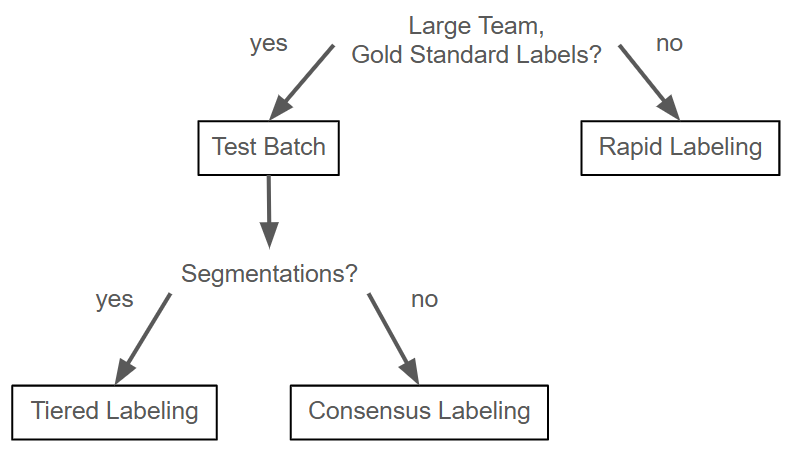

# Introduction

This guide outlines the steps involved in setting up a new labeling project on the RedBrick platform.

---

## Table of Contents
1. [Team Roles and Responsibilities](#team-roles-and-responsibilities)
2. [Labeling Taxonomy](#labeling-taxonomy)
3. [Creating a Project](#creating-a-project)
4. [Importing Data](#importing-data)
5. [Segmentation Workflow](#segmentation-workflow)
6. [Exporting Data](#exporting-data)

---

## Team Roles and Responsibilities

The first step in starting a project in RedBrick is defining team roles and adding members.

The core team includes:
- **Team Lead**: Serves as Internal Reviewer, but this member has Organizational Admin status to set up new projects.
- **Internal Reviewers**: Serve as Project Admins, manage labeling stages, and conduct quality reviews.
- **Labelers**: Perform data annotation as directed by Internal Reviewers.

Additional roles may include:
- **External Reviewers**: Validate labels during the review stage.
- **External Project Managers**: Oversee tasks with full admin privileges.

### Example Roles
- **Labelers**: Medical students and residents.
- **Internal Reviewers**: Residents.
- **External Reviewers/Managers**: Faculty or industry clients.

> ### **To add team members:**
> 1. Navigate to the **Team** tab.
> 2. Select **Invite Member**.
> 3. Assign appropriate roles:
>    - **Project Members**: Labelers and External Reviewers.
>    - **Project Admins**: Internal Reviewers and External Managers.

---

## Labeling Taxonomy

Taxonomies define the labeling schema in RedBrick AI, ensuring consistency across projects. It is necessary to define a taxonomy prior to creating a  project. 
- **Label Types**: Examples include Segmentation or Bounding Boxes.
- **Label Names**: The name of the object being labeled.
- **Attributes**: Add extra details using checkboxes (True/False), dropdown options, multiple choices, or text fields.
- **Classifications**: Attributes added to studies, series, or video frames to provide more information.
- **Hints**: Instructions visible when hovering over labels.

The following are examples of how attributes/classifications might be used in a project. 
- Brain mass segmentation: Suspected intra-axial vs extra-axial location.
- Liver segmentation: Mass present vs absent.
- Lung nodule segmentation: Clear vs indeterminate margins.
- Study classification: Adequate vs poor quality.

> ### **To create a taxonomy:**
> 1. Navigate to the **Taxonomies** tab.
> 2. Select **New Taxonomy**.
> 3. Define labels, attributes, and hints.

---

## Creating a Project

A RedBrick project workflow can be customized according to team needs. The [appendix](#appendix-recommended-labeling-workflows) of this document will include workflow recommendations for various project types. 

### Workflow Stages
- **Pre-Review**: Optional stage for evaluating data before labeling.
  - The reviewer can remove studies of poor quality from the labeling pool.
- **Pre-Label**: Optional stage that allows for studies to be given preliminary label prior to official labeling stage. 
- **Single Labeling**: Studies are labeled once by each annotator.
- **Multiple Labeling**: Studies receive several labels, and **Similarity Scores** identify discrepancies for review.
  - **Single Output Labeling**: Manual or automated data merge stage to select the best labels.
  - **Multiple Output Labeling**: Includes all labels in the final dataset.
- **Review Stage**: Labels are validated post-labeling.
  - Any number of review stages can be added in series (complete or fractional).
  - Internal reviews are recommended prior to finalizing labels.

> ### **To create a project:**
> 1. Press the **+** symbol next to the **Home** tab.
> 2. Select **New Project**.
> 3. Name the project and select the appropriate taxonomy.
> 4. Add stages as needed. For basic projects, press **+ Add Review Stage** to add a single review stage.

---

## Importing Data

There are several options for importing data into RedBrick. For projects importing data from the UTSA AI consortium or uploading prelabeled data, an **Items List** (.json file) must be generated and uploaded using the RedBRick CLI (command line interface).

### Adding a Storage Method

[See Instructions for Various Cloud Storage Integrations](https://docs.redbrickai.com/importing-data/import-cloud-data)

> #### **To add Azure blob storage:**
> 1. Navigate to your **Storage Account** on the Azure portal, select **Security + Networking** and **Access Keys**.
> 2. Copy a connections string.
> 3. Select the RedBrick Integrations tab and click **+ New storage method**.
> 4. Select Azure blob storage type and enter connection string and storage account name.
> 5. Navigate to **Storage Account** > **Settings** > **Resource Sharing (CORS)**. Use the following settings.


---

### Creating an Items List

The **Items List** is a `.json` file that contains:
- A path to each item being imported.
- Metadata to organize items into tasks.

**Example Path**:  
`container/folder/item.dcm`

[See Examples of Item Lists](https://docs.redbrickai.com/importing-data/import-cloud-data/creating-an-items-list)

To include annotations, specify:
- A path to each segmentation file.
- A segment map associating segments with taxonomy items.

Segmentation files must be in **nifti** format.

[See Examples of Item Lists for Importing Segmentations](https://docs.redbrickai.com/python-sdk/importing-annotations-guide)

> #### **To create an Items List:**
> 1. In the **Integrations** tab, click **…** for your storage method and select **Verify Storage Method**.
> 2. Create a script to generate the `items.json` file for your data.

---

### Adding Data to a Project

Use RedBrick’s command line interface (CLI) to import or export data from a project. Think of the CLI as a delivery service: after installing it, set up a "drop-off point" (a local directory) linked to your project. To upload or download data, navigate to this directory and run RedBrick commands—everything will be stored there.

> #### **To Set Up the CLI**:
> 1. Create a virtual environment and install redbrick SDK/CLI.
> ```bash
> python -m venv venv &&
> source ./venv/bin/activate &&
> pip install -U redbrick-sdk
> ```
> 2. Generate API key under **Integrations** tab.
> 3. Copy OrgID from RedBrick Url. `https://app.redbrickai.com/<org_id>/projects/<project_id>`
> 4. Add CLI credentials.
> ```bash
> redbrick config
> ```

> #### **To Create a Local Project Directory**:
> 1. Create a directory for your project.
> ```bash
> mkdir new-project &&
> cd new-project
> ```
> 2. Type `redbrick clone` to pull up a list of existing projects. Select the project you would like to associate with your local directory.
> 3. Type `redbrick info` to verify your current directory. 

> #### **To Upload an Item List**: 
> 1. Copy StorageID from the Storage Method in the **Integrations** tab.
> 2. Upload items list. Use your own STORAGE ID.
> ```bash
> redbrick upload items.json --storage STORAGEID
> ```

---

## Exporting Data

Just like importing data, exporting segmentations in RedBrick uses the command line interface. RedBrick allows for exporting labels alone or labels with studies. It also allows for conversion of DICOM studies to Nifti upon export or export of studies from specific stages.

[See RedBrick Export Commands](https://docs.redbrickai.com/python-sdk/cli-overview/exporting-annotations)

> ### To export data:
> 1. Navigate to local project directory.
> 2. Run `redbrick export` to export all tasks.

---

## Segmentation Workflow

### Task Assignment
The team lead is responsible for assigning tasks. By default, tasks in the Labeling stage are auto-assigned to team members. Any members with organizational or project admin status can select any number of studies and reassign them or manually change their stage. Additionally, prior to beginning a labeling task, it is recommended that teams have well defined labeling criteria. The Test Batch method mentioned in the appendix is recommended for testing and refining labeling criteria to avoid labeler confusion.

> #### Segmentation Workflow for Team Lead
> 1. Ensure documented labeling criteria.
> 2. Monitor labeling progress.
> 3. As studies pass Labeling stage, assign Review tasks to designated team members.

---

### Segmentation Toolkit
The following short video playlists are recommended viewing prior to beginning a labeling task. Labeling in redbrick involves organizing a 

[See Overview of the Labeling Process (Video)](https://www.youtube.com/watch?v=cl7oTHeIhsc)
[See Segmentation Toolkit Overview (Video)](https://www.youtube.com/watch?v=wsDFtPv64IM)

> #### Segmentation Workflow for Labelers/Reviewers
> 1. Review labeling criteria and segmentation toolkit videos.
> 2. Complete assigned labeling tasks.
> 3. For difficult or confusing labels, include comments.

---

Exporting Data

## Appendix: Recommended Labeling Workflows

Workflows tailored to team sizes and project types:
- **Rapid Labeling**: Best for small teams or rapid prototyping.
- **Test Batch**: Ideal for large teams or gold-standard labeling.
- **Tiered Labeling**: Recommended for segmentation tasks, with multiple review stages.
- **Consensus Labeling**: Effective for less time-intensive tasks (e.g., bounding boxes).



### Rapid Labeling  
Designed for solo or small teams aiming to quickly label datasets. This method uses single labeling and optional internal or external review for quality assurance.  


> #### To organize workflow:  
> 1. Add team members.  
> 2. Define the labeling taxonomy.  
> 3. Create a project.  
> 4. Set up a single-labeling workflow, adding internal/external reviews if needed.  

---

### Test Batch  
Used to train large teams and establish gold-standard instructions. Labelers complete an initial set of 10 studies each, with consensus-based quality checks.  

> #### To organize workflow:  
> 1. Add team members and define the labeling taxonomy.  
> 2. Create a project and enable multiple labeling with a manual single output.  
> 3. Set the minimum number of labelers to 2.  
> 4. Assign a dataset of 5x the number of labelers (e.g., 10 studies per labeler).  
> 5. After labeling, calculate similarity scores to identify inconsistencies and refine instructions.

---

### Tiered Labeling  
Optimized for segmentation tasks, where each study undergoes multiple review stages to ensure accuracy.  

> #### To organize workflow:  
> 1. Use the predefined taxonomy to create a project.  
> 2. Configure 2 review stages: internal (by experienced team members) and external (by a faculty reviewer).  
> 3. Assign labelers to the labeling stage and reviewers to respective review stages.  
> 4. Labels pass through internal review for corrections or feedback, followed by external review for final approval.  
> 5. Export finalized labels as ground truth.  

---

### Consensus Labeling  
Suitable for tasks like bounding boxes or landmarks, this approach uses multiple annotators to improve accuracy.  

> #### To organize workflow:  
> 1. Use the predefined taxonomy to create a project.  
> 2. Select a consensus approach with multiple labels, single output, and manual review. Set a minimum of 2 labelers.  
> 3. Add a review stage titled “external review.”  
> 4. An experienced labeler conducts a manual review, selecting the best label and making necessary edits.  
> 5. Use similarity scores to identify challenging cases.  
> 6. Finalized labels undergo external review and are exported as ground truth.  

---

### Clinical Validation Testing  
For clinical validation, follow the gold-standard workflow, with model-generated labels included in the dataset. Labelers remain blinded to model labels. As labeling progresses, similarity scores compare model-generated and gold-standard labels to evaluate performance.  

